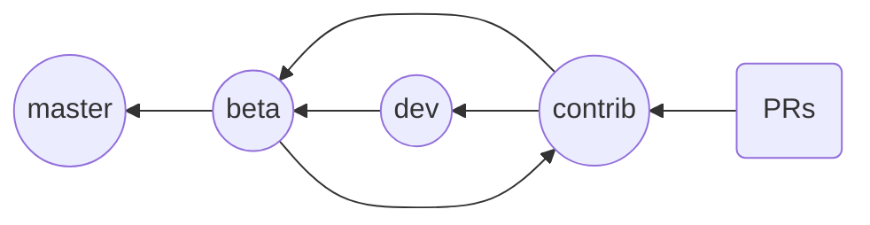

# CONTRIBUTING

When contributing to this repository, please :
 - discuss the changes you wish to make first via [issues](https://github.com/AhmedAyachi/LinkerLine/issues).
- stay active when working on a certain issue.

## Conventions To Follow

When you are working with git, please be sure to follow the conventions below on your pull requests, branches and commits:
```
PR: #[ISSUE ID] PR Title
Branch: [ISSUE ID]-pr-title
Last Commit before PR: [ACTION]: changes made
```
Example:
```
PR: #7 Fix Something
Branch: 7-fix-something (you can make it shorter if it's too long)
Commit: fix: fixing some bug in some component
```
## Installation
To start contributing to the project, follow these steps:

1. Fork this repo
2. Clone your fork	
    ```
    git clone https://github.com/<YOUR_GITHUB_ACCOUNT_NAME>/LinkerLine
    ```
3. Navigate to the project folder
    ```
    cd LinkerLine
    ```
5. Install the project dependencies with:
    ```
    npm install --save
    ```
6. Set the original repo as an upstream remote with:
    ```
    git remote add upstream https://github.com/AhmedAyachi/LinkerLine
    ```
7. Create a branch conforming to the naming above.
8. Start editing your local branch and testing your code.

## Branching Philosophy

- master : a release branch.
- beta : a pre-release branch that makes sure that the code merged from ***dev*** and ***contrib*** is coherent and stable enough.
- dev : development branch.
- contrib : PRs branch that makes sure that all PRs are coherent with each other and with the latest code.

## Notes
- PRs without an issue or with no issue reference in the title will be rejected.
- PRs targeting any branch other than the ***contrib*** branch will be rejected.
- Make sure to pull the latest version of the upstearm/contrib branch before you submit a PR.
    ```
    /* add remote */
    git remote add upstream https://github.com/AhmedAyachi/vritra-plugin-common
    
    /* Update your contrib */
	git checkout contrib
	git pull upstream contrib
	```
- Make sure you code works as expected before submitting a PR.

> A lot of things to consider and it's easy to miss some steps so if it was your first time and your PR was rejected because there was no issue associated with it, simply create the issue and submit a new PR. 

### Thanks for your intention to contribute.